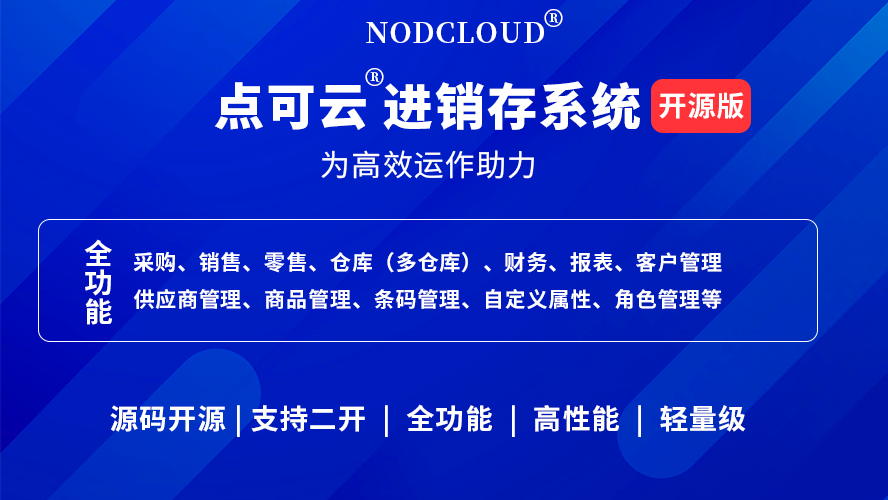
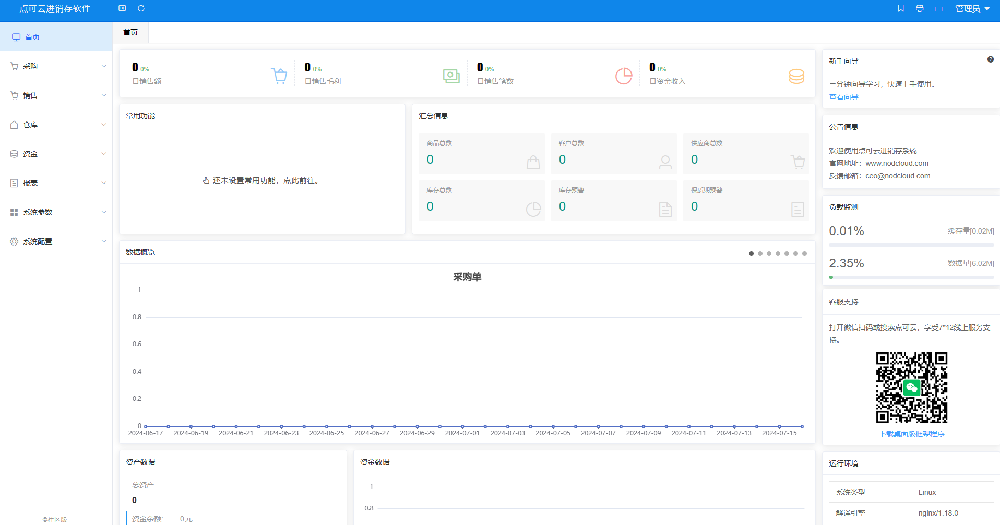
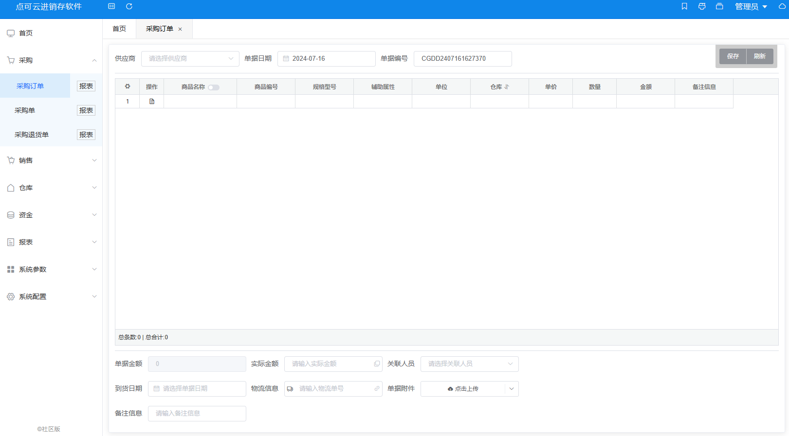
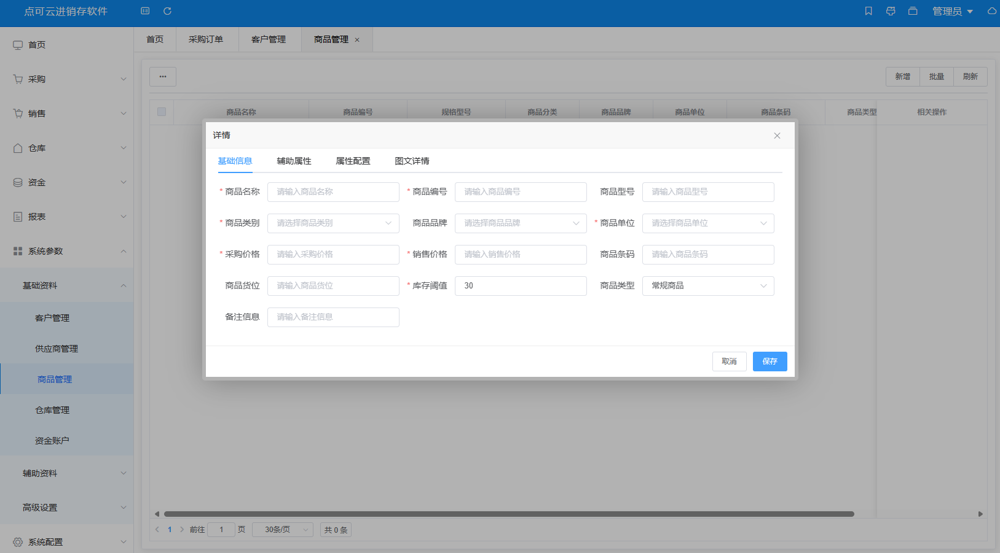
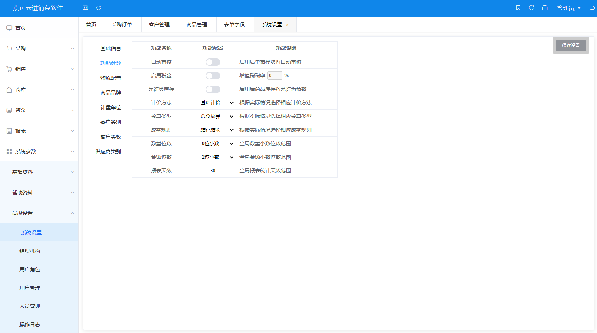

## This source code is free to download and study. We have never sold it through any channel or method. Do not trust anyone charging for copyright removal or authorization! The Community Edition is free to download, install, and set up. For commercial use, please see the licensing notes below.

## :smile: If you find this project helpful, please give it a Star — it means a lot to us. Thank you!

#### Introduction
NodCloud ERP Inventory Management System V7 Community Edition, built with ThinkPHP + Vue. Features include: purchasing, sales, retail, multi-warehouse management, financial management, and comprehensive reporting (purchase reports, sales reports, retail reports, warehouse reports, capital reports, etc.).  
Official website: [www.nodcloud.com](https://www.nodcloud.com)  
Documentation: [docs.nodcloud.com](https://docs.nodcloud.com)

#### Architecture
The ERP system uses a front-end / back-end separation architecture. The front end is built with Node.js, Vue 2, and Element-UI; the back end is built with ThinkPHP 6. It is modular and easy to extend, allowing developers to customize it according to their needs.

#### Demo
1. [Demo site](https://web.nodcloud.cn)
2. Username: `admin`
3. Password: `admin`

#### Requirements
1. PHP 7.3+
2. MySQL 5.6 (for 5.7+, disable strict mode — [video tutorial](https://www.bilibili.com/video/BV1F54y1A7Vc) | [text tutorial](https://docs.nodcloud.com/erp/v7/com))
3. ThinkPHP URL rewriting must be configured

#### Project Structure
1. `serve` — back-end code
2. `web` — front-end code

#### Build Instructions
1. Build the front-end code and place it in the directory specified by the development docs.
2. Upload the back-end code to the server root directory and access it.

#### Documentation & Tutorials
1. [User manual](https://docs.nodcloud.com/erp/v7/doc)
2. [Developer guide](https://docs.nodcloud.com/erp/v7/dev)
3. [Video tutorials](https://space.bilibili.com/1914574537)

#### Community Edition
1. The Community Edition is derived from the original commercial version, with complete business logic refined over multiple iterations.
2. The Community Edition is for learning and communication purposes only. Commercial use requires authorization.
3. Due to third-party component licensing restrictions, the Community Edition does not include printing functionality.
4. Due to sales policy, the Community Edition will not include the retail module in the short term.
5. [Fully licensed version](https://v7.nodcloud.cn)

#### Version History
1. V5 Community Edition: [Gitee](https://gitee.com/yimiaoOpen/nodcloud-v5)
2. V6 Community Edition: [Gitee](https://gitee.com/yimiaoOpen/nodcloud)
3. V7 Community Edition: current version
4. V8 Commercial Edition: [erp.nodcloud.com](https://erp.nodcloud.com)

#### Commercial Edition
1. V8 Commercial Edition is NodCloud's flagship product, offering long-term after-sales support.
2. V8 Commercial Edition features a brand-new Laravel + Vue 3 architecture with continuous updates.
3. V8 Commercial Edition supports all platforms (Android, iOS, Mini Programs).
4. [Product introduction](https://www.nodcloud.com/product/erp)
5. [Live demo](https://erp.nodcloud.com)

#### Community
1. Community Edition QQ group: 640974004
2. QQ group 1: 280470323
3. QQ group 2: 219813486
4. QQ group 3: 640974004
5. Online support: [click to view](https://www.nodcloud.com/about#contact)
6. Support hotline: 400-728-0806

### Screenshots
#### Dashboard

#### Orders

#### Products

#### System

#### :smile: For more features, please visit the demo site or deploy it yourself.
